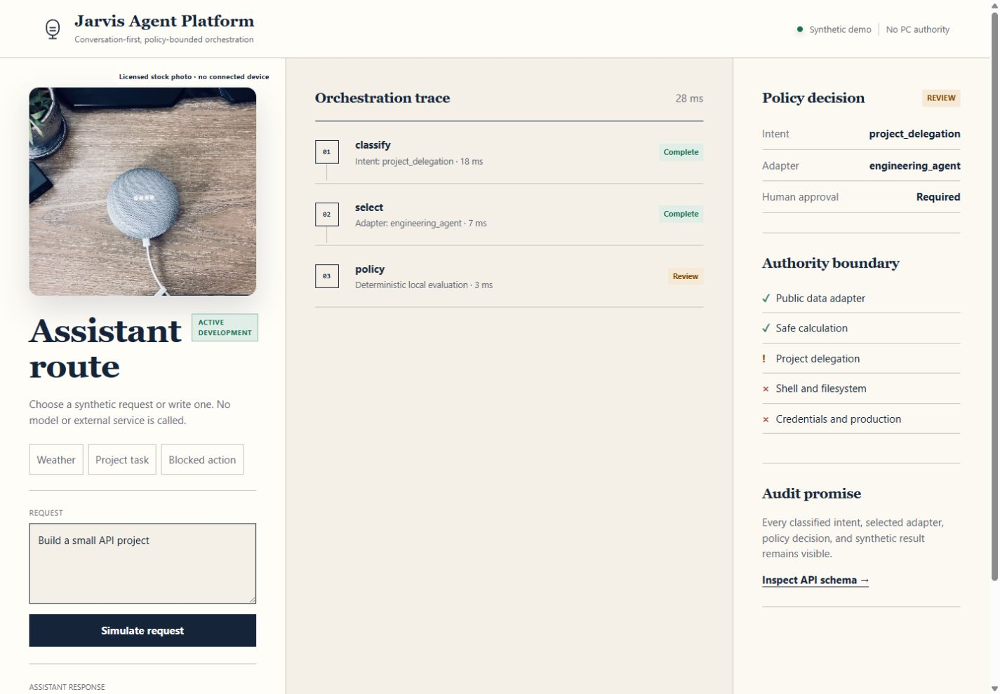
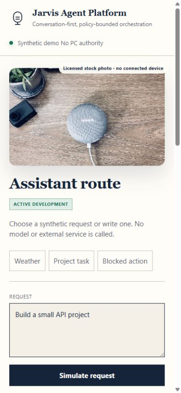
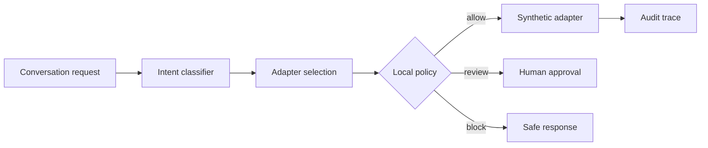

# Jarvis Agent Platform Demo

> **Status:** This project is currently under active development. Adapter contracts, policy rules,
> and interface details may change as the prototype evolves.

A public-safe demonstration of a conversation-first AI assistant architecture. The demo classifies
a synthetic request, selects a narrow adapter, evaluates deterministic policy, and returns an audit
trace that explains what was allowed, reviewed, or blocked.

It contains no voice recordings, personal memory, local paths, API keys, real PC actions, shell
access, or private project data.

## Interface

<p align="center">
  
  
</p>

## Architecture



The language model is not the policy authority. Tool names, allowed actions, risk classes, and
human-review requirements are evaluated in deterministic Python code.

## Demonstrated concepts

- typed intents and adapter contracts;
- explicit allowlist and risk classification;
- human approval for project delegation;
- blocked shell, filesystem, credential, and production actions;
- auditable step-by-step orchestration;
- FastAPI delivery and a responsive synthetic-data index page.

## Run

```bash
python -m pip install -e ".[dev]"
uvicorn app.main:app --reload
pytest
ruff check .
```

Open `http://127.0.0.1:8000` or inspect `/docs`.
